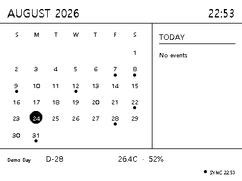
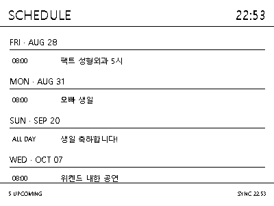
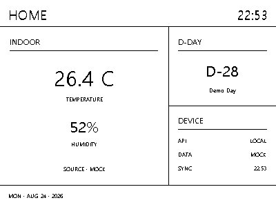
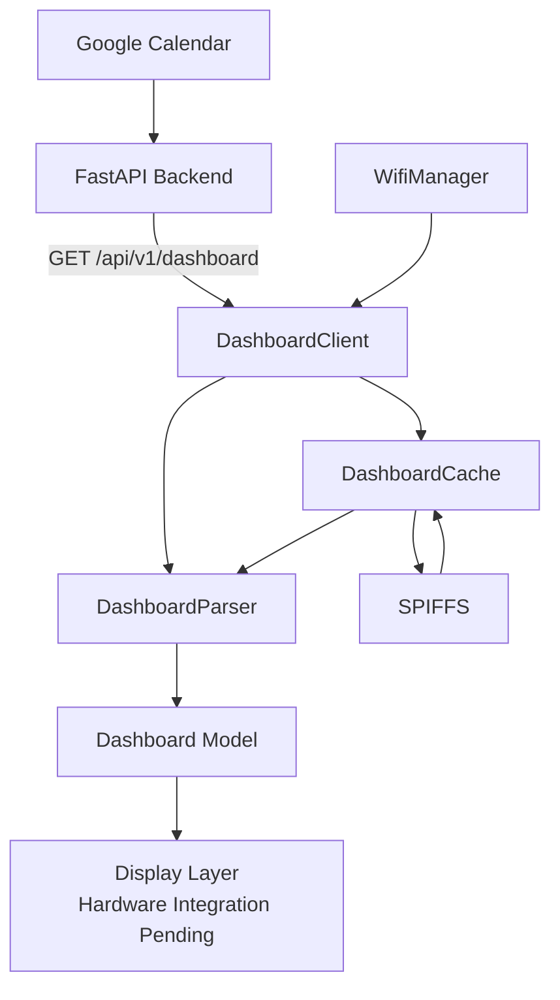
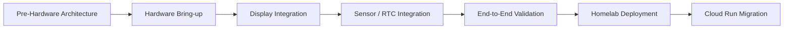

# Paperdesk

[](https://github.com/GH-00/paperdesk/actions/workflows/ci.yml)

Paperdesk is a compact desk dashboard built around an ESP32-S3 reflective display.

It combines a FastAPI backend, Google Calendar integration, an ESP-IDF firmware client, offline caching, and a 400 × 300 monochrome simulator.

The project is currently at the **Pre-Hardware Development** milestone.  
The backend, firmware data path, fallback architecture, simulator, and CI pipeline are complete, while physical hardware integration is pending.

---

## Preview

The simulator renders the same 400 × 300 monochrome layout targeted by the physical display.

### Calendar

<p align="center">
  
</p>

### Schedule

<p align="center">
  
</p>

### Home

<p align="center">
  
</p>

---

## Architecture



Paperdesk separates the responsibilities of the backend and the firmware.

```text
Backend
    → Defines WHAT should be displayed

Firmware / Simulator
    → Defines HOW it should be rendered
```

The ESP32 does not communicate directly with Google Calendar.

```text
Google Calendar
      │
      ▼
FastAPI Backend
      │
      ▼
Dashboard API
      │
      ▼
ESP32-S3
```

Google OAuth credentials therefore remain on the backend side.

---

## Firmware Application Flow

The firmware prefers the latest backend data but can continue using the last valid dashboard when the network or backend is unavailable.

```text
Boot
 │
 ▼
DashboardCache Initialize
 │
 ▼
WifiManager Initialize
 │
 ▼
Wi-Fi Connect
 │
 ├─ Success
 │    │
 │    ▼
 │ Dashboard API
 │    │
 │    ├─ Success
 │    │    │
 │    │    ├─ Update Dashboard
 │    │    └─ Save Raw JSON Cache
 │    │
 │    └─ Failure
 │         │
 │         ▼
 │      Cache Load
 │
 └─ Failure
      │
      ▼
   Cache Load
      │
      ├─ Success
      │    └─ Last Known Dashboard
      │
      └─ Failure
           └─ data_available = false
```

This design allows Paperdesk to tolerate temporary failures such as:

- Wi-Fi outages
- Backend downtime
- HTTP request failures
- Temporary upstream calendar failures

---

## Target Hardware

Paperdesk targets the **Waveshare ESP32-S3-RLCD-4.2**.

Target hardware features include:

- ESP32-S3
- 400 × 300 monochrome reflective LCD
- Wi-Fi / Bluetooth
- SHTC3 temperature and humidity sensor
- PCF85063 RTC
- KEY button
- microSD support
- Battery support

Hardware-specific runtime integration is intentionally deferred until the physical board is available.

---

## Tech Stack

### Backend

- Python 3.12
- FastAPI
- Pydantic
- Google Calendar API
- pytest

### Firmware

- C++
- ESP-IDF v5.5.5
- ESP32-S3
- `esp_http_client`
- ESP-IDF Wi-Fi
- cJSON
- SPIFFS

### Simulator

- Python
- Pillow
- 400 × 300
- 1-bit monochrome rendering

### DevOps

- Git
- GitHub
- GitHub Actions
- Feature branch workflow

---

## Project Structure

```text
paperdesk/
├─ backend/
│  ├─ app/
│  │  ├─ models/
│  │  ├─ providers/
│  │  └─ main.py
│  └─ tests/
│
├─ firmware/
│  ├─ main/
│  │  ├─ api/
│  │  │  ├─ dashboard_client.*
│  │  │  └─ dashboard_parser.*
│  │  │
│  │  ├─ application/
│  │  │  └─ paperdesk_app.*
│  │  │
│  │  ├─ models/
│  │  │  └─ dashboard.hpp
│  │  │
│  │  ├─ network/
│  │  │  └─ wifi_manager.*
│  │  │
│  │  └─ storage/
│  │     └─ dashboard_cache.*
│  │
│  ├─ partitions.csv
│  └─ sdkconfig
│
├─ simulator/
│  ├─ pages/
│  └─ render.py
│
├─ docs/
│  └─ images/
│
└─ .github/
   └─ workflows/
      └─ ci.yml
```

---

## Backend API

The firmware consumes a single dashboard-oriented API.

```http
GET /api/v1/dashboard
```

The response contains the data required by the dashboard, including:

```text
Device information
Calendar information
Calendar events
D-Day information
Environment information
```

The API intentionally avoids display-specific information such as:

```text
Pixel coordinates
Font sizes
Widget positions
Display driver details
```

This allows the same API contract to be consumed by both the simulator and the physical firmware.

---

## Google Calendar Integration

Google Calendar integration is implemented on the backend.

```text
Google OAuth
     │
     ▼
GoogleCalendarProvider
     │
     ▼
Dashboard API
```

The firmware never stores or processes Google OAuth credentials.

For tests, the real provider is replaced with a mock provider so CI does not require:

- `credentials.json`
- `token.json`
- Google account access
- External Calendar API calls

---

## Simulator

The simulator provides hardware-independent validation of the dashboard layout.

Target display characteristics:

```text
Resolution: 400 × 300
Color depth: 1-bit monochrome
```

Available pages:

- Calendar
- Schedule
- Home

Render all pages:

```powershell
python -m simulator.render --page all
```

Generated images are written to:

```text
simulator/output/
```

---

## Backend Development

Create a virtual environment:

```powershell
python -m venv .venv
```

Activate it:

```powershell
.\.venv\Scripts\Activate.ps1
```

Install dependencies:

```powershell
pip install -r requirements.txt
```

Run the FastAPI backend:

```powershell
uvicorn backend.app.main:app --reload
```

Run backend tests:

```powershell
cd backend

python -m pytest -q
```

Current test suite:

```text
13 passed
```

---

## Firmware Build

Required environment:

```text
ESP-IDF v5.5.5
Target: esp32s3
```

Build:

```powershell
cd firmware

idf.py build
```

The current firmware implements:

- Dashboard data model
- JSON parsing
- HTTP dashboard client
- Wi-Fi Station manager
- Offline SPIFFS cache
- Application orchestration
- API / cache fallback flow
- Explicit no-data state

Physical firmware flashing is pending hardware availability.

---

## Offline Cache

The last valid dashboard response is stored in SPIFFS.

```text
/spiffs/dashboard.json
```

Normal operation:

```text
Dashboard API
     │
     ▼
Validated JSON
     │
     ├─ Dashboard
     │
     └─ SPIFFS Cache
```

Failure path:

```text
Wi-Fi / API Failure
        │
        ▼
     SPIFFS
        │
        ▼
 Cached JSON
        │
        ▼
DashboardParser
        │
        ▼
Last Known Dashboard
```

If both the API and cache are unavailable:

```text
data_available = false
```

This state can later be rendered by the physical display as a dedicated `No Data` screen.

---

## Flash Partition Layout

A custom development partition table is currently used.

```text
2 MiB Development Layout

0x009000
├─ nvs
│  └─ 0x6000

0x00f000
├─ phy_init
│  └─ 0x1000

0x010000
├─ factory
│  └─ 0x140000

0x150000
└─ storage
   └─ 0xb0000
      └─ SPIFFS
```

This layout is **not considered the final hardware configuration**.

The final Flash, PSRAM, and partition configuration will be validated against the official Waveshare board configuration after hardware arrival.

---

## Continuous Integration

GitHub Actions validates both backend and firmware changes.

```text
Pull Request → develop
        │
        ▼
    Paperdesk CI
        │
        ├────────────────┐
        ▼                ▼
 Backend tests      Firmware build
        │                │
 Python 3.12        ESP-IDF v5.5.5
        │                │
     pytest          idf.py build
        │                │
        └───────┬────────┘
                ▼
               PASS
```

The CI workflow runs on:

```text
Pull Request → develop
Push → develop
```

### Backend CI

```text
Ubuntu 24.04
Python 3.12
requirements install
python -m pytest -q
```

### Firmware CI

```text
Ubuntu runner
ESP-IDF v5.5.5
Target esp32s3
idf.py build
```

No Google OAuth credentials or Wi-Fi credentials are required by CI.

---

## Current Status

### Pre-Hardware Development

- [x] FastAPI backend
- [x] Google Calendar integration
- [x] Dashboard API
- [x] Dashboard API contract
- [x] Backend tests
- [x] 400 × 300 simulator
- [x] Calendar page
- [x] Schedule page
- [x] Home page
- [x] Firmware dashboard model
- [x] JSON parser
- [x] HTTP client
- [x] Wi-Fi Station manager
- [x] Offline SPIFFS cache
- [x] Application flow
- [x] Failure / fallback handling
- [x] Custom development partition layout
- [x] ESP-IDF build
- [x] GitHub Actions Backend CI
- [x] GitHub Actions Firmware CI

### Hardware Integration

- [ ] Validate official Waveshare example
- [ ] Verify Flash configuration
- [ ] Verify PSRAM configuration
- [ ] Finalize partition layout
- [ ] Flash Paperdesk firmware
- [ ] Validate Wi-Fi runtime
- [ ] Validate real Backend API communication
- [ ] Validate SPIFFS mount / read / write
- [ ] Integrate ST7305 display
- [ ] Render Calendar page
- [ ] Render Schedule page
- [ ] Render Home page
- [ ] Implement KEY page switching
- [ ] Integrate SHTC3
- [ ] Integrate RTC
- [ ] Validate battery operation
- [ ] Power optimization

---

## Roadmap



---

## Development Milestone

Paperdesk is currently at:

```text
v0.1 — Pre-Hardware Development
```

The following architecture is complete and reproducible without physical hardware:

```text
Google Calendar
       │
       ▼
FastAPI Backend
       │
       ▼
Dashboard API
       │
       ▼
ESP32-S3 Firmware Data Path
       │
       ├─ Online Data
       └─ Offline Cache

+ Simulator
+ Automated Backend Tests
+ Automated Firmware Builds
```

The next development milestone begins with physical board bring-up and hardware runtime validation.